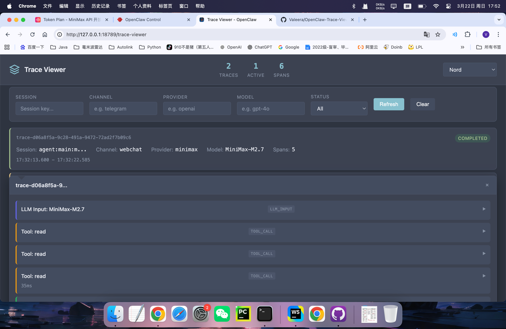
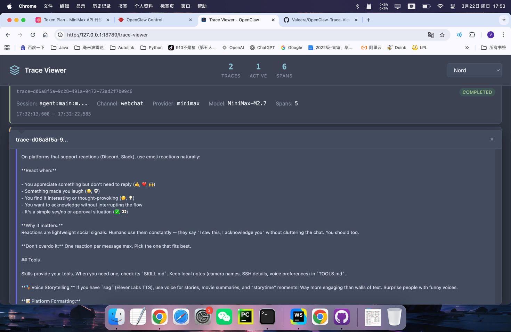

# @openclaw/trace-viewer

Visual trace viewer for OpenClaw model interactions. Inspect LLM inputs/outputs, tool calls, session lifecycle, and span metadata in a rich dark-mode UI with multiple color themes.




## Features

- **Trace timeline** — View all model interactions with status, channel, provider, and model info
- **Span inspection** — Drill into individual spans (LLM input/output, tool calls, session events) with full metadata
- **Filtering** — Filter by session, channel, provider, model, or status
- **Theme support** — Default, Nord, Dracula, Monokai, Solarized Light, Gruvbox
- **In-memory store** — Bounded buffer (1000 traces, 500 spans/trace); no external DB required

## Install

Copy the plugin into your global extensions folder:

```bash
mkdir -p ~/.openclaw/extensions
cp -R extensions/trace-viewer ~/.openclaw/extensions/trace-viewer
cd ~/.openclaw/extensions/trace-viewer && pnpm install
```

Restart the Gateway afterwards. Enable the plugin.

## Quick Start for a New Plugin Project

To emit traces from your own plugin, emit the hooks that trace-viewer listens for:

```typescript
// In your plugin's register() callback
api.on("llm_input", (event, ctx) => {
  // event: { runId, sessionId, provider, model, prompt, systemPrompt, ... }
  // ctx: { sessionKey, agentId, channelId, runId }
});

api.on("llm_output", (event, ctx) => {
  // event: { runId, sessionId, provider, model, assistantTexts, usage, ... }
});

api.on("before_tool_call", (event, ctx) => {
  // event: { toolName, params, runId }
});

api.on("after_tool_call", (event, ctx) => {
  // event: { toolName, result, error, durationMs, runId }
});

api.on("session_start", (event, ctx) => {
  // event: { sessionId, resumedFrom }
});

api.on("session_end", (event, ctx) => {
  // event: { sessionId, messageCount, durationMs }
});
```

trace-viewer will automatically capture and display these events.

## Access the UI

Once enabled, visit:

```
http://localhost:18789/trace-viewer
```

Or via the Gateway Web UI.

## API Endpoints

| Endpoint                       | Method | Description                                                                                    |
| ------------------------------ | ------ | ---------------------------------------------------------------------------------------------- |
| `/trace-viewer`                | GET    | Web UI (HTML)                                                                                  |
| `/api/trace-viewer/traces`     | GET    | List traces (query: `sessionKey`, `channel`, `provider`, `model`, `status`, `limit`, `offset`) |
| `/api/trace-viewer/traces/:id` | GET    | Get single trace with all spans                                                                |
| `/api/trace-viewer/stats`      | GET    | Global stats (totalTraces, activeTraces, totalSpans)                                           |
| `/api/trace-viewer/test-trace` | POST   | Create a sample trace for testing                                                              |
| `/api/trace-viewer/debug`      | GET    | Debug info                                                                                     |

## Configuration

The plugin is `enabledByDefault: true` and has no required configuration. To explicitly enable/disable:

```json
{
  "plugins": {
    "entries": {
      "trace-viewer": {
        "enabled": true
      }
    }
  }
}
```

## Hooks Consumed

| Hook               | Trigger                 |
| ------------------ | ----------------------- |
| `llm_input`        | Before LLM inference    |
| `llm_output`       | After LLM inference     |
| `before_tool_call` | Before a tool is called |
| `after_tool_call`  | After a tool returns    |
| `session_start`    | Session begins          |
| `session_end`      | Session ends            |

## Span Types

| Type            | Color  | Description           |
| --------------- | ------ | --------------------- |
| `llm_input`     | Indigo | LLM prompt/inputs     |
| `llm_output`    | Green  | LLM outputs/responses |
| `tool_call`     | Amber  | Tool invocation       |
| `tool_result`   | Orange | Tool result/response  |
| `session_start` | Purple | Session start         |
| `session_end`   | Pink   | Session end           |
| `message`       | Cyan   | Message event         |

Docs: https://github.com/VaIeera/OpenClaw-Trace-Viewer
